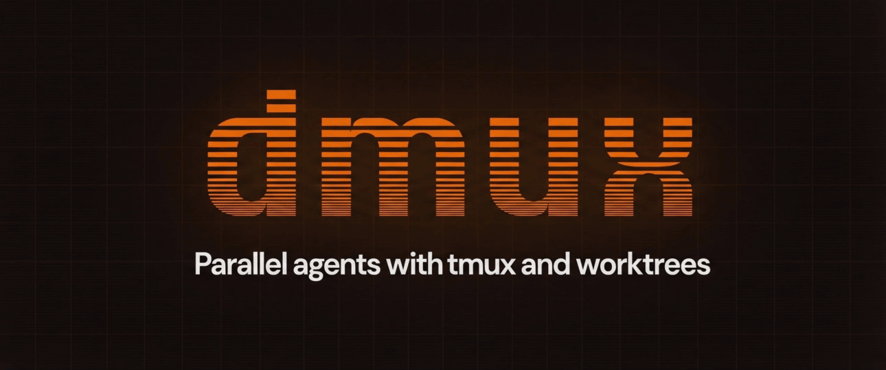

<p align="center">
  
</p>

<h3 align="center">Parallel agents with tmux and worktrees</h3>

<p align="center">
  Manage multiple AI coding agents in isolated git worktrees.<br/>
  Branch, develop, and merge &mdash; all in parallel.
</p>

<p align="center">
  <a href="https://dmux.ai"><strong>Documentation</strong></a> &nbsp;&middot;&nbsp;
  <a href="https://dmux.ai#getting-started"><strong>Getting Started</strong></a> &nbsp;&middot;&nbsp;
  <a href="https://github.com/formkit/dmux/issues"><strong>Issues</strong></a>
</p>

---



## Install

```bash
npm install -g dmux
```

## Quick Start

```bash
cd /path/to/your/project
dmux
```

Press `n` to create a new pane, type a prompt, pick an agent, and dmux handles the rest &mdash; worktree, branch, and agent launch.

## What it does

dmux creates a tmux pane for each task. Every pane gets its own git worktree and branch so agents work in complete isolation. When a task is done, press `m` to merge it back into your main branch.

- **Worktree isolation** &mdash; each pane is a full working copy, no conflicts between agents
- **Agent support** &mdash; Claude Code, Codex, and OpenCode
- **A/B launches** &mdash; run two agents on the same prompt side-by-side
- **AI naming** &mdash; branches and commit messages generated automatically
- **Smart merging** &mdash; auto-commit, merge, and clean up in one step
- **Multi-project** &mdash; add multiple repos to the same session
- **Lifecycle hooks** &mdash; run scripts on worktree create, pre-merge, post-merge, and more

## Keyboard Shortcuts

| Key | Action |
|-----|--------|
| `n` | New pane (worktree + agent) |
| `t` | New terminal pane |
| `j` / `Enter` | Jump to pane |
| `m` | Merge pane to main |
| `x` | Close pane |
| `p` | New pane in another project |
| `s` | Settings |
| `q` | Quit |

## Requirements

- tmux 3.0+
- Node.js 18+
- Git 2.20+
- At least one agent: [Claude Code](https://docs.anthropic.com/en/docs/claude-code), [Codex](https://github.com/openai/codex), or [OpenCode](https://github.com/opencode-ai/opencode)
- Optional: [GitHub CLI](https://cli.github.com/) (`gh`) for PR workflow

## Documentation

Full documentation is available at **[dmux.ai](https://dmux.ai)**, including setup guides, configuration, and hooks.

## License

MIT
