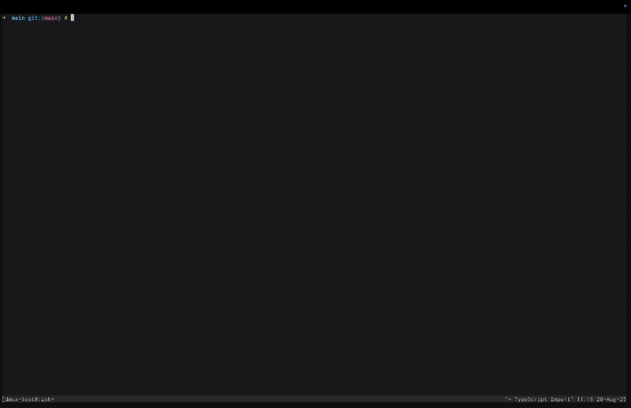

<p align="center">
  
</p>

# dmux - AI-Powered tmux Development Sessions

Tools for running agents in parallel are too complex. `dmux` makes running parallel development agents like Claude Code or opencode very simple. It's a simple tool that creates a new tmux pane, a new git worktree, and launches your chosen agent (Claude Code or opencode) in that worktree, with AI powered branch naming and commit messages.

`dmux` lets you merge the open panes back into your main branch easily, close failed experiments, and spin up more agents quickly.



## Features

- **🚀 Parallel Development**: Work on multiple features simultaneously in separate panes
- **🌳 Git Worktree Integration**: Each pane operates in its own isolated git worktree
- **🤖 AI-Powered**: Automatic branch naming and commit message generation
- **🎯 Agent Integration**: Launch Claude Code or opencode with prompts (Claude auto-accepts edits)
- **📦 Project Isolation**: Each project gets its own tmux session
- **🔄 Smart Merging**: One-command merge workflow with automatic cleanup

## Prerequisites

- **tmux** 3.0 or higher
- **Node.js** 18 or higher  
- **Git** 2.20 or higher (with worktree support)
- **Agent CLI**: Claude Code (`claude`) or opencode (`opencode`)
- **OpenRouter API Key** (optional but recommended for AI features)

## Installation

### 1. Install dmux

```bash
npm install -g dmux
```

### 2. Enable AI Features

For AI-powered branch naming and commit messages:

```bash
# Add to your ~/.bashrc or ~/.zshrc
export OPENROUTER_API_KEY="your-api-key-here"
```

Get your API key from [OpenRouter](https://openrouter.ai/).

## Quick Start

### Basic Usage

1. **Start dmux in your project**
   ```bash
   cd /path/to/your/project
   dmux
   ```
   If you run `dmux` from a different repo while already inside a `dmux-*` tmux session, dmux will prompt to add that repo into the current session.

2. **Create a new development pane**
   - Press `n` or select "+ New dmux pane"
- Enter an optional prompt like "fix authentication bug"
- Your selected agent launches in a new pane with your prompt

3. **Navigate between panes**
   - Use `↑/↓` arrows to select panes
   - Press `j` or `Enter` to jump to a pane

4. **Merge your work**
   - Select the pane you want to merge
   - Press `m` to merge into main branch
   - Confirm to close the pane

## Keyboard Shortcuts

| Key | Action |
|-----|--------|
| `↑/↓` | Navigate pane list |
| `Enter` or `j` | Jump to selected pane |
| `n` | Create new dmux pane |
| `p` | Create pane in another project |
| `N` | Create pane in another project (legacy) |
| `m` | Merge worktree to main |
| `x` | Close selected pane |
| `q` | Quit dmux interface |
| `ESC` | Cancel current dialog |

## Project structure

When using git worktrees, its helpful to have your project's main source code in a "main" directory. Worktrees are then checked out as siblings of the main directory.

```bash
# Start dmux in your project
cd ~/projects/my-app/main
dmux

# Create a pane for a new feature
# Press 'n', enter: "add user dashboard"
# The agent opens with your prompt

# Create another pane for a bug fix
# Press 'n', enter: "fix memory leak"
# Work on both simultaneously

# When feature is complete
# Select the pane, press 'm' to merge

# Jump between panes as needed
# Press 'j' on any pane to switch focus
```

## How It Works

1. **Session Management**: Each project gets its own tmux session (`dmux-projectname`)
2. **Worktree Creation**: New panes create git worktrees in sibling directories
3. **Branch Management**: Automatic branch creation with AI-generated names
4. **Agent Integration**: Launches Claude with `--accept-edits`, or starts opencode and submits your prompt automatically
5. **Smart Merging**: Auto-commits, generates messages, and cleans up worktrees

## tmux Configuration for Beginners

While dmux handles most tmux operations automatically, having a good tmux configuration can enhance your experience. This isn't the place to learn tmux comprehensively, but here's a helpful configuration to get you started.

### A simple tmux configuration

If you aren't a heavy tmux user, consider creating this to your `~/.tmux.conf` file:

```bash
# Visual distinction between active and inactive panes
set -g window-style 'fg=colour247,bg=colour236'
set -g window-active-style 'fg=default,bg=colour234'

# Pane borders
set -g pane-border-style "fg=colour238 bg=default"
set -g pane-active-border-style "fg=blue bg=default"

# Status bar styling
set -g status-style 'bg=colour236'

# Keyboard shortcuts for pane navigation
# Hold Ctrl+Shift and use arrow keys to move between panes
bind -n C-S-Left select-pane -L
bind -n C-S-Right select-pane -R
bind -n C-S-Up select-pane -U
bind -n C-S-Down select-pane -D

# Enable mouse support (click panes, resize with mouse)
set -g mouse on
```

### Key Features of This Configuration

- **Visual Feedback**: Active panes have a darker background and blue border
- **Easy Navigation**: Hold `Ctrl+Shift` and use arrow keys to switch between panes instantly
- **Mouse Support**: Click on panes to focus them, drag borders to resize

After adding this configuration, reload tmux:
```bash
tmux source-file ~/.tmux.conf
```

Or start a new tmux session for the changes to take effect.

## Requirements Summary

- tmux ≥ 3.0
- Node.js ≥ 18
- Git ≥ 2.20
- Claude Code or opencode CLI (at least one)
- OpenRouter API key (optional)
